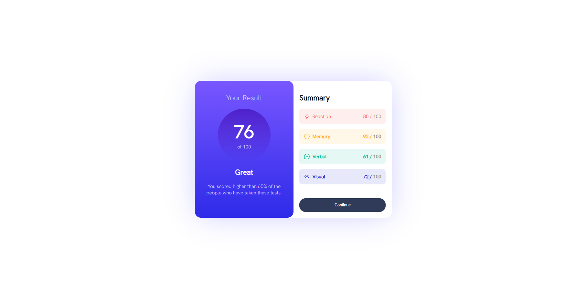

# Frontend Mentor - Results summary component solution

This is a solution to the [Results summary component](https://www.frontendmentor.io/challenges/results-summary-component-CE_K6s0maV). Frontend Mentor challenges help you improve your coding skills by building realistic projects.

## Table of contents

- [Overview](#overview)
  - [Screenshot](#screenshot)
  - [Links](#links)
- [My process](#my-process)
  - [Built with](#built-with)
  - [What I learned](#what-i-learned)
  - [Useful resources](#useful-resources)
- [Author](#author)

## Overview

This program creates a web page that displays a user's result and a summary of scores for different categories. It is styled using CSS, and the layout is designed to be responsive to different screen sizes. The program uses fonts and color schemes to create an attractive and visually appealing presentation of the data.

### Screenshot

### Links

- Solution URL: [Github Repo](https://github.com/nurwandhika/nft-preview-card)
- Live Site URL: [Github Pages](https://nurwandhika.github.io/nft-preview-card/)

## My process

1. First, I modified the HTML file to add important components, including the container and all the content.

2. After that, I started working on the CSS. I began by setting the background color and then proceeded to style the container, scores, and all the summary content.

3. Within the container, I added the big score and small score. On the right side, I positioned the content for reaction, memory, verbal, and visual.

4. Finally, I added the "Continue" button, and when the user hovers the pointer over it, it changes color

### Built with

- Semantic HTML5 markup
- CSS custom properties
- Flexbox
- Box shadow
- Background Image
- Border radius

### What I learned

1. HTML Structure:

- The HTML document is structured with typical HTML elements.
- It includes metadata like character encoding, viewport settings, and links to external resources.
- The document defines a title for the webpage.

2. CSS Styling:

- The CSS is used to style the webpage.
- Fonts: The "Hanken Grotesk" font is imported and applied to the entire page using @font-face.
- Page layout: The body is styled to use Flexbox for centering content both horizontally and vertically.
- The content is contained within a container with a defined width, rounded corners, and a box shadow.
- The page is divided into two sections: the left and right sides.
- Various elements, such as headings, paragraphs, buttons, and images, are styled using different colors, fonts, and background gradients.

3. Left Side Styles:

- The left side has a gradient background and contains information about a test result.
- It displays a score, a description, and a heading with specific styling.

4. Right Side Styles:

- The right side displays a summary of different category scores.
- Each category score is presented as an individual box with an icon, category name, and a numerical score.

5. Score Styles:

- The scores are styled with background colors, border radius, and padding to create a box-like appearance.
- Different categories (e.g., memory, verbal, visual) have unique background colors and font colors.

6. Button Styles:

- A "Continue" button is styled with a background color, padding, border-radius, and a hover effect.

7. Responsive Design:

- Media queries are used to adjust the layout for smaller screens.
- For smaller screens, the left and right sides take up the entire width, and rounded corners are modified to maintain the design's aesthetic.

### Useful resources

- [Dicoding](https://www.dicoding.com/) - This website helped me acquire the fundamentals of web development.
- [Stack Overflow](https://stackoverflow.com/) - This is a common Q&A website for programmers. In this project, I used this website almost everytime I forgot something and needed a quick solution.

## Author

- Website - [Nurwandhika Rachman](https://github.com/nurwandhika)
- Frontend Mentor - [@nurwandhika](https://www.frontendmentor.io/profile/nurwandhika)
- Twitter - [@nurwandhikar](https://www.twitter.com/nurwandhikar)
